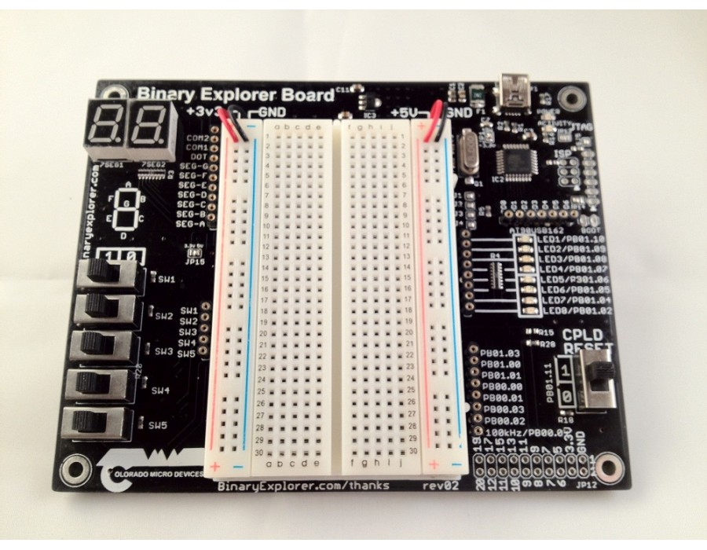

# Binary Explorer #

The Binary Explorer board is based on a previous Kickstarter project, and is designed to provide a useful platform for learning about digital logic. Compared to the previous version, the CPLD has been changed to an Altera MAX II which can be used with more recent design software (including on Windows 10). Note the old ("rev 02") version is completely incompatible with the current version, as the entire CPLD and programming interface has changed.

Binary Explorer includes:

- Altera MAX II CPLD which can be disabled to bypass outputs
- Breadboard for building logic circuits
- Switches, LEDs, and 7-segment displays
- Clocks for CPLD

## Reference Designs / Examples ##

A number of templates/examples are provided for the Altera Quartus software. Always use these templates, as they contain considerable critical configuration regarding the device in use and board-specific setting (including pinouts and use of global disable).

If you fail to use these templates and things break, **we will laugh at you when they break**. 

## Using Breadboard ##

To use the breadboard, it's important to set the CPLD to "OFF". The "OFF" position should disable the I/O drivers on the CPLD, but it relies on the CPLD having been configured based on one of the template files.

If you do not set the CPLD to "OFF", or have programmed it with invalid code, you could find certain pins are being driven high/low against your will.

**NEVER use 5.0V on this board** - all I/O will only survive with 3.3V. The board does not include a 5.0V source to avoid this risk, but **DO NOT wire in an external 5.0V source**.

Be sure to **confirm any logic chips you are using** will operate at 3.3V OK.

## USB CPLD Programmer ##

The USB CPLD programming interface is provided thanks to work published at http://sa89a.net/mp.cgi/ele/ub.htm . This pushed the CPLD programming onto one of the lowest-cost USB interface chips which made this entire project possible.

We have adapted this design, with some very minor firmware changes to provide a slow and fast clock to the CPLD. This is often useful during development.

